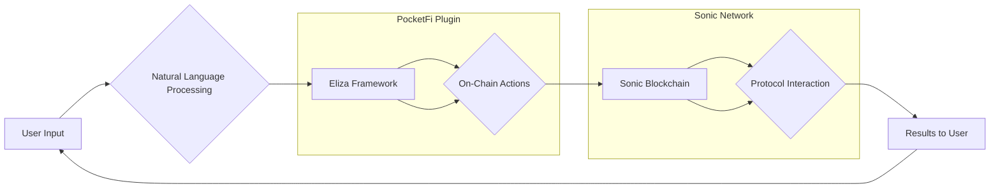

<h3 align="center">
The Gateway to Simplified DeFi and Payment Services.
</h3>

<p align="center">
  <strong>Pocket Finance</strong> is the first truly modular network of interoperable on-chain payment agents simplifying <strong>DeFi</strong>.
</p>

## Useful Resources
Demo Video: https://youtu.be/uu7GbqnAtQQ

Website URL: https://pocketfi.vercel.app

PocketFi Sonic Plugin: https://www.npmjs.com/package/@pocketfinance/sonic-plugin

## About Pocket Finance

**Pocket Finance** was built entirely on the [PocketFi Sonic Plugin](https://github.com/amdonatusprince/pocket/tree/main/plugin-sonic). This open-source plugin empowers anyone to integrate with the **Sonic Blockchain** and perform on-chain actions such as transfers, payments, swaps, staking, bridging, and financial analysis. By integrating with the **PocketFi Sonic Plugin**, projects can add support for their protocols, making it easy for users to interact directly with their services through **Pocket Finance**.

Designed to enhance the accessibility of DeFi and provide a seamless user experience, bridging the gap between traditional finance and Web3 through advanced AI technology; Pocket Finance extends the capabilities of the **Eliza Agent Framework** to deliver an intuitive experience for everyday users.

## Architecture Workflow

Here is a high-level workflow diagram showcasing how Pocket Finance integrates with the **Sonic Blockchain** via the **PocketFi Sonic Plugin** and **Eliza Agent Framework**:


The workflow above illustrates the seamless communication from user input to on-chain interactions, empowering users to interact with DeFi protocols using intuitive, natural language commands.

---

## PocketFi Sonic Plugin

The **PocketFi Sonic Plugin** is a powerful open-source tool that extends the **Eliza Agent Framework** to interact with the **Sonic Blockchain**. This plugin simplifies DeFi operations by allowing users to interact with the blockchain using natural language, enabling on-chain operations like transfers, staking, swaps, and more. 

- **GitHub Repository for Sonic Plugin**: [@pocketfinance/sonic-plugin](https://github.com/amdonatusprince/pocket/tree/main/plugin-sonic)
- **Powered by**: [Eliza Agent Framework](https://github.com/elizaOS/eliza)

### Key Features of PocketFi Sonic Plugin:

- **AI-Powered Natural Language Interactions**: Perform complex DeFi and financial actions using simple, conversational language.
- **Modular Protocol Integration**: Any protocol can be integrated with the **Sonic Blockchain** via the Eliza Agent Framework.
- **On-Chain Interaction**: Enable decentralized operations like transfers, staking, swaps, and more.

---

### Allora and Pyth Data Integration

Pocket Finance also supports **Allora** and **Pyth Data**, unlocking even more powerful capabilities for users:

- **Allora Support**: Users can access the latest on-chain data and analytics from **Allora** topics to make informed decisions.
- **Pyth Data Integration**: Through **Pyth**, users gain access to real-time, high-fidelity financial data, enabling them to make more accurate predictions and investment strategies within the **DeFi** space.

---

## Features of Pocket Finance

Pocket Finance automatically provides several features and functionalities, making decentralized finance (DeFi) and payments more accessible and user-friendly:

### 1. **DeFi and Payment Simplification**:
   - Easily interact with decentralized finance protocols.
   - Conduct payments and transfers within the Sonic ecosystem.
   - Onboard users into Web3 with a seamless experience via **Privy**’s intuitive interface.

### 2. **Integration with Sonic Blockchain**:
   - Pocket Finance allows users to seamlessly interact with various decentralized services on the **Sonic Blockchain**, leveraging the power of AI-driven interactions.

### 3. **AI-Powered Financial Analysis**:
   - Receive intelligent financial advice, including market analysis, token performance insights, and personalized investment strategies.

### 4. **Modular and Extensible Architecture**:
   - The PocketFi Sonic Plugin allows developers to integrate their protocols and create new DeFi use cases directly within the Pocket Finance ecosystem.

---

## For Protocol Developers

The **PocketFi Sonic Plugin** is designed to be extensible. Developers can integrate their own protocols into the **Sonic ecosystem** by using the **Eliza Agent Framework** templates. This allows protocols to offer AI-powered interactions, enabling users to engage with the protocol through natural language.

### Steps for Integration:
1. **Fork the repository**: Begin by forking the **[PocketFi Sonic Plugin GitHub repository](https://github.com/amdonatusprince/pocket/tree/main/plugin-sonic)**.
2. **Add Protocol Integration**: Use the Eliza agent templates to add your protocol's integration.
3. **Submit a Pull Request**: Once your integration is complete, submit a Pull Request to contribute your changes.
4. **Review and Deployment**: Our team will review your submission and assist with getting your protocol live on Pocket Finance.

**Example Code for Integration**:

```typescript
// src/actions/your-protocol.ts
export class YourProtocolAction {
    // Implementation following Eliza patterns
}

export const yourProtocolAction: Action = {
    name: "your-protocol",
    description: "Interact with YourProtocol on Sonic network",
    // ... other required fields
};
```

---

## Configuration

### Default Setup

By default, the **PocketFi Sonic Plugin** is disabled. To enable it, add your **private key** and **public key** to the `.env` file:

```env
SONIC_PRIVATE_KEY=your-private-key-here
SONIC_PUBLIC_KEY=your-public-key-here
PERPLEXITY_API_KEY=your-api-key-here
```

**Security Note**: Never share your private key and ensure your `.env` file is stored securely. Do not upload it to any public repositories.

### Custom RPC URLs

If you wish to use custom RPC URLs for the Sonic network, configure them in the `.env` file:

```env
SONIC_PROVIDER_URL=https://your-custom-sonic-rpc-url
```

---

## Actions

The **PocketFi Sonic Plugin** offers various on-chain actions that users can perform through natural language:

### 1. **Get Financial Info**:
   - Get professional financial advice using the **Perplexity AI model**. Ask for market analysis, investment strategies, or token performance insights.

   **Example usage**:
   ```bash
   What's the current market sentiment for Bitcoin?
   ```

### 2. **Get Balance**:
   - Retrieve the balance of any address on the **Sonic Blockchain**.

   **Example usage**:
   ```bash
   Get the USDC balance of 0x1234567890 on Sonic.
   ```

### 3. **Transfer**:
   - Transfer tokens between addresses on the Sonic network.

   **Example usage**:
   ```bash
   Transfer 100 S token to 0xRecipient.
   ```

### 4. **Deploy Token**:
   - Deploy new token contracts on the Sonic blockchain, including ERC20, ERC721, and ERC1155 token types.

   **Example usage**:
   ```bash
   Deploy an ERC20 token with name 'MyToken', symbol 'MTK', decimals 18, total supply 10000.
   ```

### 5. **Bridge**:
   - Bridge tokens between different blockchains.

   **Example usage**:
   ```bash
   Bridge 1 SONIC from Ethereum to Sonic network.
   ```

### 6. **Swap**:
   - Swap tokens on Sonic with OpenOcean and Pocket Finance's in-app swap.

   **Example usage**:
   ```bash
   Bridge 100 SONIC from Ethereum to Sonic network.
   ```

### 7. **Stake**:
- **Stake Tokens**: To stake a specific amount of tokens and earn rewards, specify:
  - **Token** (e.g., S, USDC)
  - **Amount**

**Example Usage:**

```bash
Stake 10000 S on the staking contract.

   ```
---

## How to Contribute

Pocket Finance is an open-source project! We welcome contributions from the community, whether you're adding new protocol integrations, improving existing features, fixing bugs, or enhancing documentation.

### Running Tests:

To ensure the stability of the plugin, please run tests before submitting a pull request:

```bash
yarn test
```

---

## License

This project is licensed under the MIT License - see the [LICENSE](LICENSE) file for details.

